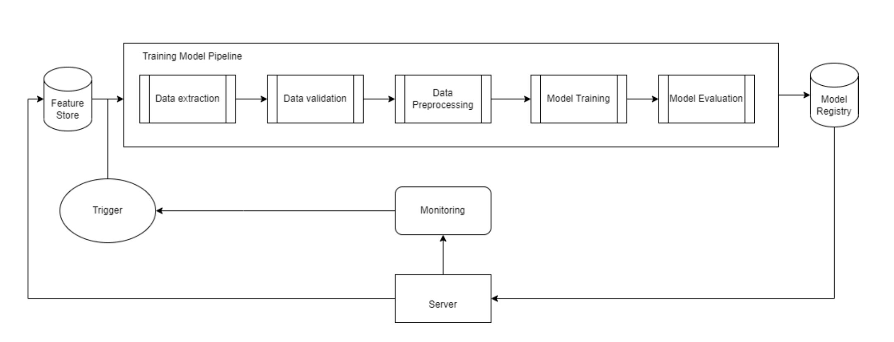

# MLOps IRIS CLASSIFICATION

## ClearML
1) [Upload dataset](clearml_tasks/data_extraction_task.py)
2) [Validate data](clearml_tasks/data_validation_task.py): all images have label file
3) [Preprocess dataset](clearml_tasks/data_preparation_task.py): apply paddock maks to image
4) [Train model](clearml_tasks/model_training_task.py): train yolov5 model
5) [Training pipeline](clearml_tasks/pipeline_task.py): build training pipeline from 2-4 tasks
6) [Scheduler](clearml_tasks/trigger_task.py): create training scheduler from pipeline